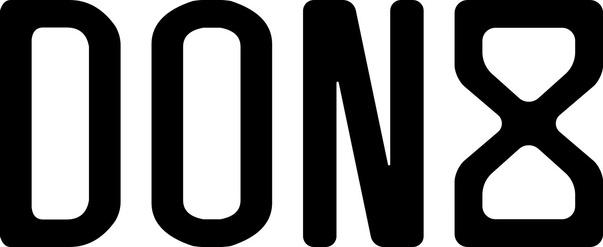
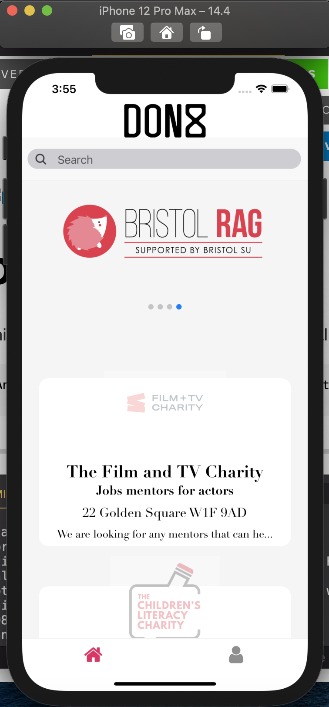

<p  align="center">
</img>
<br />
<br />


<a  href="https://github.com/bear99a9/don8#readme"  target="_blank">


</a>

<a  href="https://github.com/bear99a9/don8/graphs/commit-activity"  target="_blank">


</a>

<a  href="https://github.com/bear99a9/don8/graphs/commit-activity">


</a>

<a  href="https://github.com/bear99a9/don8/commits/main">


</a>

<a  href="https://github.com/bear99a9/don8/graphs/contributors">


</a>

<a  href="https://www.npmjs.com/">


</a>

<br />
<H1>Live Demo</H1>
<a href="https://www.youtube.com/watch?v=epjusmKqPDY" target="_blank"></br>Click here</a>
</p>

# Don8

Makers Academy Final Project **don8**.

```
An app that connects local and national charities to volunteers and goods in their area.
```

---

- [Specification](#specification)
  - [Requirements](#requirements)
- [Getting Started](#getting-started)
  - [Prerequisite(s)](#prerequisite-s-)
  - [Installation](#installation)
- [Running the Program](#running-the-program)
- [Testing](#testing)
- [Development Process](#development-process)
  - [User Stories](#user-stories)
    - [User Story 01](#user-story-01)
    - [User Story 02](#user-story-02)
    - [User Story 03](#user-story-03)
    - [User Story 04](#user-story-04)
    - [User Story 05](#user-story-05)
    - [User Story 06](#user-story-06)
    - [User Story 07](#user-story-07)
  - [Domain Modelling](#domain-modelling)
  - [Test-Driven Design](#test-driven-design)
  - [Behaviour-Driven Design](#behaviour-driven-design)
  - [Continuous Development](#continuous-development)
  - [Refactoring](#refactoring)
- [Minimum Viable Product](#minimum-viable-product)
  - [Wireframes](#wireframes)
- [Project Conclusions](#project-conclusions)
  - [Final Appearance](#final-appearance)
  - [Specific Characteristics of Note](#specific-characteristics-of-note)
  - [Additional Development](#additional-development)
- [Built With](#built-with)
- [Author(s)](#author-s-)
- [License(s)](#license-s-)
- [Acknowledgements](#acknowledgements)

---

## Specification

---

## Getting Started

### Prerequisite(s)

This project requires _software_. If you do not have _software_, install it using [these instructions](https://www.google.co.uk/).

### Installation

1. Run command `npm install`
2. cd backend
3. Run command `npm install`

---

## Running the Program

1. Run command `npm start` to start the frontend server.
2. cd backend
3. Run command `npm start` to start the backend server.

---

## Testing

We used Jest for tests on both the back end. We have high back end test coverage of 96.94% over 12 tests, but need to work on our front end coverage.

```sh
~ cd backend
~ npm test

```

## Development Process

#### User Stories

##### User Story 01

&nbsp;&nbsp;&nbsp;As a charity,<br>
&nbsp;&nbsp;&nbsp;So that I can advertise for donations of time or goods,<br>
&nbsp;&nbsp;&nbsp;I'd like to be able to post adverts.

##### User Story 02

&nbsp;&nbsp;&nbsp;As a donor,<br>
&nbsp;&nbsp;&nbsp;So that I can donate,<br>
&nbsp;&nbsp;&nbsp;I'd like to be able to see charities' adverts.

##### User Story 03

&nbsp;&nbsp;&nbsp;As a charity,<br>
&nbsp;&nbsp;&nbsp;So that I can manage my adverts,<br>
&nbsp;&nbsp;&nbsp;I'd like to be able to sign up as a charity.

##### User Story 04

&nbsp;&nbsp;&nbsp;As a charity,<br>
&nbsp;&nbsp;&nbsp;So that I can manage my adverts,<br>
&nbsp;&nbsp;&nbsp;I'd like to be able to log in and out.

##### User Story 05

&nbsp;&nbsp;&nbsp;As a donor,<br>
&nbsp;&nbsp;&nbsp;So that I can filter adverts,<br>
&nbsp;&nbsp;&nbsp;I'd like to be able to search by location, chairty name and description.

##### User Story 06

&nbsp;&nbsp;&nbsp;As a donor,<br>
&nbsp;&nbsp;&nbsp;So that I can see how far away the advert is,<br>
&nbsp;&nbsp;&nbsp;I'd like to be able to see the location on google maps.

##### User Story 07

&nbsp;&nbsp;&nbsp;As a donor,<br>
&nbsp;&nbsp;&nbsp;So that I can visit the charities website,<br>
&nbsp;&nbsp;&nbsp;I'd like to be able to click on a link from the advert.

#### Domain Modelling

As per [Class Responsibility Collaborator](http://agilemodeling.com/artifacts/crcModel.htm) modelling, there are _n_ obvious areas of responsibility, and therefore _n_.

Class: **Name**

| Responsibility | Collaborators |
| -------------- | ------------- |
|                |

The relationship between these classes can be summarised in this Domain Model Diagram:


### Test-Driven Design

TDD was used to structure Unit Tests. These were employed to test individual classes and their methods to ensure that they interacted as expected.

### Behaviour-Driven Design

BDD was used to structure Feature Tests. After unit tests were created to test methods and classes in isolation, feature tests were employed to test the entire program.

### Refactoring

Refactoring was performed after the completion of any individual unit, and periodically throughout development, in order to simplify the code. The aim was to keep the code simple and readable, rather than as compact as possible. To check that the resulting code conformed to the Ruby style guide, it was parsed before each commit through _ESlint_, a linter.

---

## Minimum Viable Product

- Charity can post what they need - either time or goods
- Volunteers can see what charities need

### Wireframes

The appearance of an MVP version of our program was projected to look something like as follows:

 

The most basic model of this is described as follows:


---

## Project Conclusions

### Final Appearance

### Specific Characteristics of Note

The presented development state shows some aspects of note:

1.

### Additional Development

With more time, we would have liked to add some additional features:

1.

---

## Built With

This program's dependencies are:

- [Expo](https://docs.expo.io/)
- [React Native](https://reactnative.dev/)
- [MongoBD](https://www.mongodb.com/)

This program's development and test frameworks depend upon:

- [ESLint](https://eslint.org/)
- [Jest](https://jestjs.io/)
- [Cypress](https://www.cypress.io/)

---

## Author(s)

Proudly authored by [Oscar Bertrand](https://github.com/OscarB89), [Hugh Cavanagh](https://github.com/hacaravan), [Sean Edwards](https://github.com/bear99a9), [Joshua Sinyor](https://gist.github.com/JoshSinyor) and [Louis Wickremeratne](https://github.com/louiswicks).

---

## License(s)

This project is licensed under the [MIT License](LICENSE).

---

## Acknowledgements

- Table of contents generated with [markdown-toc](http://ecotrust-canada.github.io/markdown-toc/).
- Wireframes generated with [Figma](https://www.figma.com/).
- Diagrams generated with [Diagram.codes](https://www.diagram.codes/).
- API testing conducted with [Postman](https://www.postman.com/).
